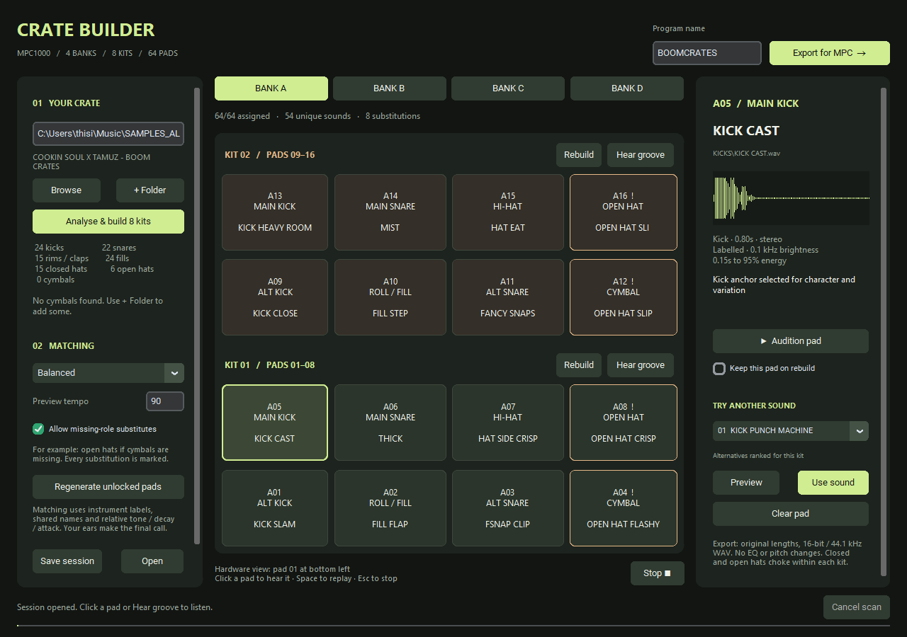

# CrateBuilder

CrateBuilder turns a folder of drum samples into an MPC1000 program you can audition, adjust, and copy to your memory card.

It builds eight small kits across the MPC's four banks. Each kit uses eight pads, so you can move between two related kits without leaving the bank. The app runs locally on Windows, leaves your original samples alone, and does not need an account or internet connection.

It can also convert a complete folder of WAV, AIFF, and FLAC files to MPC-ready 44.1 kHz, 16-bit WAVs without building a program.



## What it makes

One export contains:

- one classic MPC1000 `.PGM` program;
- four banks and eight kits;
- 64 assigned pads;
- converted 44.1 kHz, 16-bit WAV copies;
- a readable pad map;
- an editable CrateBuilder session; and
- notes about substitutions or skipped files.

Each half-bank follows the same layout:

| Pad | Sound |
| --- | --- |
| 01 / 09 | Alternate kick |
| 02 / 10 | Snare roll or short fill |
| 03 / 11 | Alternate snare, rim, or clap |
| 04 / 12 | Cymbal |
| 05 / 13 | Main kick |
| 06 / 14 | Main snare |
| 07 / 15 | Closed hi-hat |
| 08 / 16 | Open hi-hat |

The closed and open hats in each kit share a mute group, so they choke one another without cutting off the hats in another kit.

## Install the Windows app

The easiest way to use CrateBuilder is the standalone Windows build.

1. Open the repository's **Releases** page.
2. Download `CrateBuilder.exe` from the latest release.
3. Put it in a folder where it can save its session and cache.
4. Double-click it to start.

The executable is currently unsigned, so Windows may show a SmartScreen warning. Check that the download came from this repository before choosing **More info -> Run anyway**. First launch can take a few seconds.

## Use CrateBuilder

1. Paste a sample-folder path or click **Browse**.
2. Click **Analyse & build 8 kits**. CrateBuilder scans that folder and its subfolders for WAV, AIFF, and FLAC files.
3. Choose bank A-D. Pads 01-08 are the first kit and pads 09-16 are the second.
4. Click a pad to inspect it. Use **Audition pad** to hear the sample or **Hear groove** to hear the kit in context.
5. Use **Preview** to try another candidate and **Use sound** to keep it. Kept pads remain locked when you rebuild.
   You can also turn **Keep on rebuild** on or off directly on any pad.
6. If the pack is missing a sound category, use **+ Folder** to add more samples. You can also disable substitutions and leave missing roles empty.
7. Enter a short program name and click **Export for MPC**.
8. Copy the whole exported folder to your MPC card, then load the `.PGM` from the MPC's LOAD screen.

Space replays the selected pad and Escape stops playback. The preview groove is only there to compare kits; CrateBuilder does not export a sequence.

## Convert a complete sample folder

Use **Convert folder to MPC WAV** when you want compatible audio files without creating kits or a PGM program.

1. Paste or browse to the source folder.
2. Click **Convert folder to MPC WAV**.
3. Choose where the converted folder should be created.

CrateBuilder includes all supported files in the source folder and its subfolders. It preserves the folder structure, converts the files to 44.1 kHz/16-bit PCM WAV, and gives files and folders short ASCII names that are safer on the MPC1000. Mono and stereo are preserved. It does not trim, tune, normalize, time-stretch, or apply EQ.

The output includes `FILE_MAP.csv`, which connects every original path to its converted name, and `CONVERSION_REPORT.txt`. Unreadable files and audio with more than two channels are listed in the report. The originals are never changed.

## How the matching works

CrateBuilder starts with filenames and folder names because labelled samples are usually the clearest evidence. It then measures brightness, decay, attack, dynamics, leading silence, and clipping. Main kicks anchor the kits, and the remaining sounds are ranked by family names and relative character.

The matcher avoids identical audio inside a kit, discourages excessive reuse, and prefers short files for fill slots. When a pack does not contain every requested role, optional substitutions are clearly marked in amber.

This is a practical sorting system rather than a model of musical taste. It does not tune drums, detect musical key, time-stretch fills, extract hits from breaks, or apply EQ. Listening and replacing a few choices is still part of making a good kit.

## Install from source

You need Windows, Python 3.12, and a Python installation with Tk support.

```powershell
git clone https://github.com/diamond-one/CrateBuilder.git
cd CrateBuilder
python -m venv .venv
.\.venv\Scripts\Activate.ps1
python -m pip install --upgrade pip
python -m pip install -r requirements.txt
python run.py
```

If PowerShell blocks activation, you can run the environment's Python directly:

```powershell
.\.venv\Scripts\python.exe -m pip install -r requirements.txt
.\.venv\Scripts\python.exe run.py
```

## Command-line use

The same builder can run without the graphical interface:

```powershell
python run.py --scan "D:\Samples\My Pack" `
  --export "D:\MPC Programs" `
  --session "MyCrate.session.json" `
  --name MYCRATE
```

Validate an existing export with:

```powershell
python run.py --validate "D:\MPC Programs\MYCRATE\MYCRATE.PGM"
```

Other options include `--strict` for no substitutions, plus `--seed`, `--style`, `--bpm`, and `--cache`.

Folder conversion is also available from the command line:

```powershell
python run.py --convert "D:\Samples\My Pack" `
  --convert-destination "D:\MPC Samples"
```

## Build the executable

Install the development dependency and run the build script:

```powershell
python -m pip install pyinstaller==6.22.2
.\build.ps1
```

The finished executable is written to `dist\CrateBuilder.exe`.

## MPC compatibility

CrateBuilder writes the classic binary MPC1000 PGM 1.00 format, not the newer MPC XPM format. Exported samples use 44.1 kHz, 16-bit PCM WAV. Mono and stereo are retained, and audio is resampled only when needed. Source loudness is left alone unless attenuation is required to prevent clipping.

The writer has automated coverage for all 64 assignments, pad roles, locks, reproducible matching, missing categories, corrupt audio, conversion, safe filenames, PGM references, velocity bounds, mute groups, repeated exports, and preview levels. The generated program also round-trips through the independent `pympc1000` parser.

Physical MPC1000 loading still needs broader testing across Akai OS and JJOS versions. Save existing MPC work before trying a newly generated program.

## Run the tests

```powershell
.\.venv\Scripts\python.exe -m unittest discover -s tests -v
```

## Data and sample ownership

Analysis stays on your computer. CrateBuilder reads original samples and writes converted copies into the export folder; it never edits the source files. Cached analysis and the autosaved session live under `%LOCALAPPDATA%\CrateBuilder`.

Your samples remain subject to the licence supplied by their creator. Do not upload sample packs or generated kits unless you have permission to redistribute them.

## Credits

The default PGM template and independent test parser come from [Stephen Norum's pympc1000](https://github.com/stephenn/pympc1000) under the zlib licence. Format notes are based on the community documentation for [MPC1000 PGM 1.00](https://mybunnyhug.org/fileformats/pgm/). [MPC Maid](https://github.com/cyriux/mpcmaid) was useful background research; its application code was not copied.

Third-party notices are included in the `licenses` folder.

